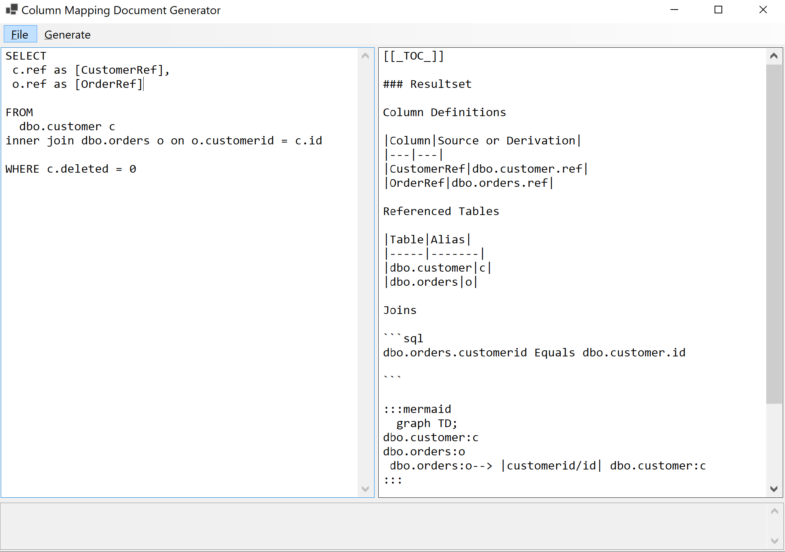

# ParserPrototype

Prototype code for documenting SQL code as Markdown

This is currently just for Azure Devops Wiki formatting

This is using [SQL ScriptDom](https://devblogs.microsoft.com/azure-sql/programmatically-parsing-transact-sql-t-sql-with-the-scriptdom-parser/)

